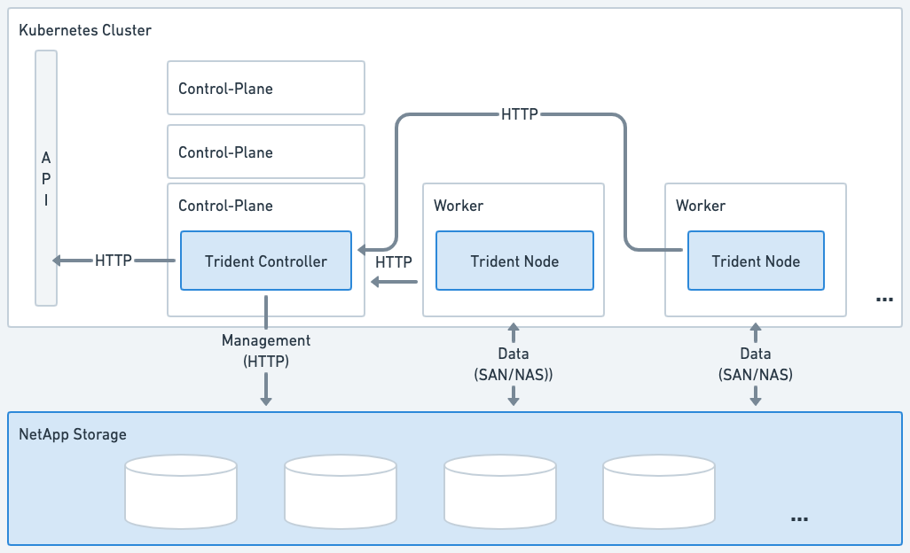
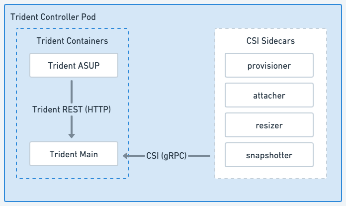
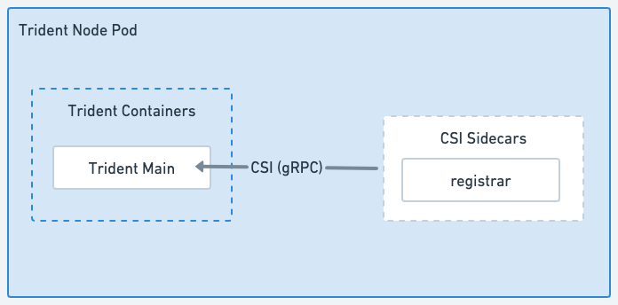

= Tridentアーキテクチャ
:hardbreaks:
:allow-uri-read: 
:icons: font
:imagesdir: ../media/

[role="lead"]
Trident は、クラスター内の各ワーカー ノード上で単一のコントローラー ポッドと 1 つのノード ポッドとして実行されます。ノード ポッドは、 Tridentボリュームをマウントする可能性があるすべてのホストで実行されている必要があります。

[[understanding-controller-pods-and-node-pods]]
== コントローラーポッドとノードポッドについて

Tridentは単体で展開<<Tridentコントローラー ポッド>>1つ以上の<<Tridentノードポッド>>Kubernetes クラスター上で、標準の Kubernetes _CSI サイドカー コンテナー_ を使用して CSI プラグインのデプロイメントを簡素化します。link:https://kubernetes-csi.github.io/docs/sidecar-containers.html["Kubernetes CSI サイドカーコンテナ"^] Kubernetes ストレージ コミュニティによってメンテナンスされています。

Kuberneteslink:https://kubernetes.io/docs/concepts/scheduling-eviction/assign-pod-node/["ノードセレクター"^]そしてlink:https://kubernetes.io/docs/concepts/scheduling-eviction/taint-and-toleration/["寛容と汚点"^]ポッドを特定のノードまたは優先ノードで実行するように制限するために使用されます。  Trident のインストール中に、コントローラーとノード ポッドのノード セレクターと許容値を構成できます。

* コントローラー プラグインは、スナップショットやサイズ変更などのボリュームのプロビジョニングと管理を処理します。
* ノード プラグインは、ストレージをノードに接続する処理を行います。

.Kubernetes クラスターにデプロイされたTrident

[[trident-controller-pod]]
=== Tridentコントローラー ポッド

Tridentコントローラー ポッドは、CSI コントローラー プラグインを実行する単一のポッドです。

* NetAppストレージのボリュームのプロビジョニングと管理を担当
* Kubernetesデプロイメントによって管理
* インストール パラメータに応じて、コントロール プレーンまたはワーカー ノードで実行できます。

.Tridentコントローラー ポッドの図

[[trident-node-pods]]
=== Tridentノードポッド

Trident Node Pod は、CSI Node プラグインを実行する特権 Pod です。

* ホスト上で実行されているポッドのストレージのマウントとアンマウントを担当します
* Kubernetes DaemonSetによって管理される
* NetAppストレージをマウントするノードで実行する必要がある

.Trident Node Pod の図

[[supported-kubernetes-cluster-architectures]]
== サポートされているKubernetesクラスタアーキテクチャ

Trident は、次の Kubernetes アーキテクチャでサポートされています。

[cols="3,1,2"]
|===
| Kubernetes クラスター アーキテクチャ | サポート | デフォルトインストール 

| シングルマスター、コンピューティング | はい  a| 
はい

| 複数のマスター、コンピューティング | はい  a| 
はい

| マスター、 `etcd` 、計算 | はい  a| 
はい

| マスター、インフラストラクチャ、コンピューティング | はい  a| 
はい

|===