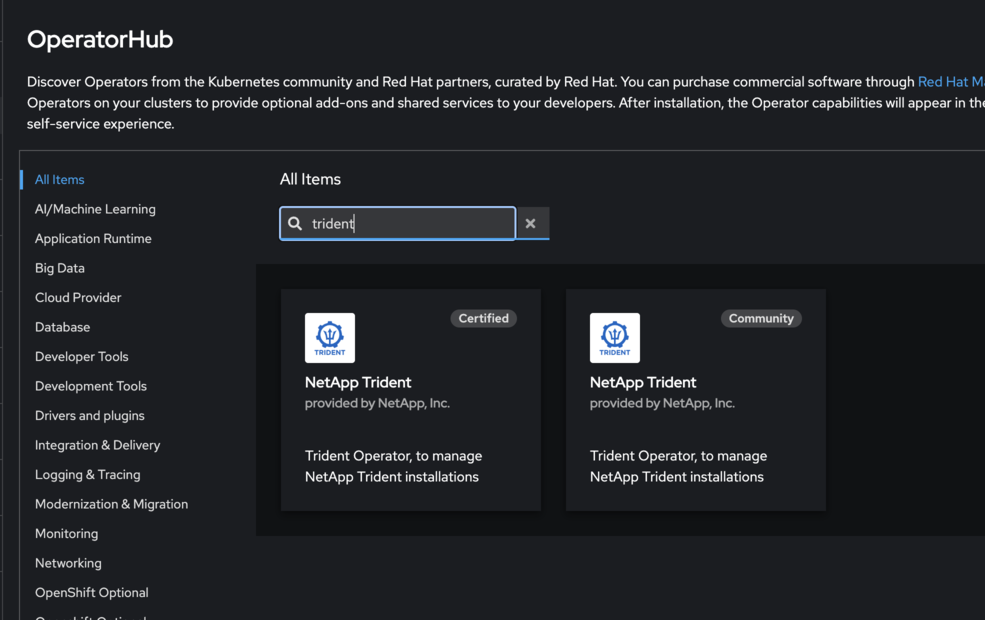
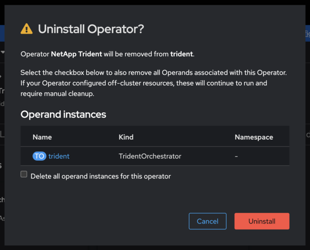

= TridentコミュニティオペレーターからOpenShift認定オペレーターに切り替える
:hardbreaks:
:allow-uri-read: 
:icons: font
:imagesdir: ../media/

[role="lead"]
NetAppコミュニティTrident Operator から Red Hat OpenShift 認定Trident Operator に切り替えるには、コミュニティ オペレータをアンインストールしてから、OperatorHub を使用して認定オペレータをインストールする必要があります。

.開始する前に
インストールを始める前に、link:../trident-get-started/requirements.html["Trident をインストールするための環境を準備する"] 。

[[uninstall-the-netapp-trident-community-operator]]
== NetApp Tridentコミュニティオペレータをアンインストールする

.手順
. OpenShift コンソールを使用して OperatorHub に移動します。
+

. NetApp Tridentコミュニティ オペレーターを探します。
+

+

WARNING: *この演算子からすべてのオペランドインスタンスを削除する*を選択しないでください。

. *アンインストール*をクリックします。

[[install-the-openshift-certified-operator]]
== OpenShift認定オペレーターをインストールする

.手順
. Red Hat OperatorHub に移動します。
. NetApp Trident Operator を検索して選択します。
+

. 画面上の指示に従ってオペレーターをインストールします。

[[verification]]
== 検証

* コンソールの OperatorHub をチェックして、新しい認定オペレーターが正常にインストールされていることを確認します。

