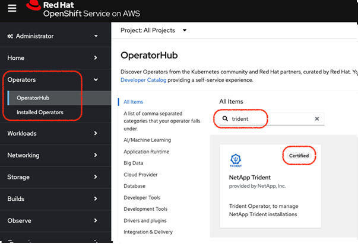
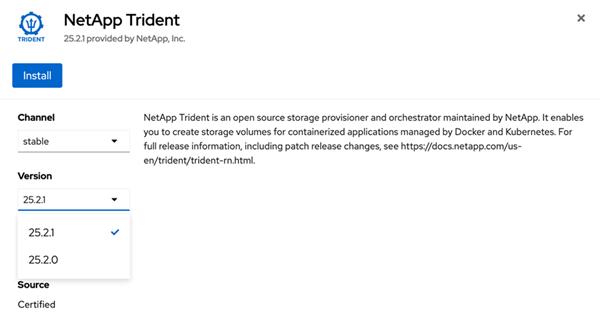
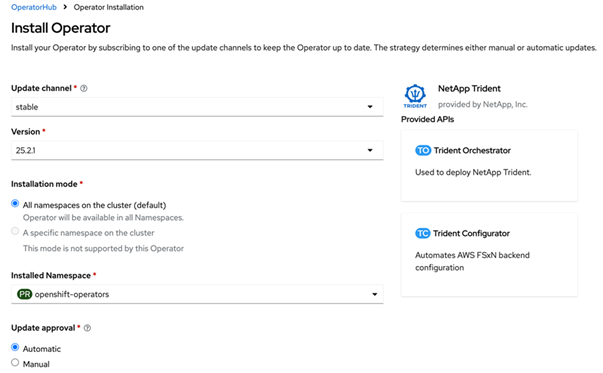
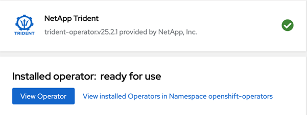
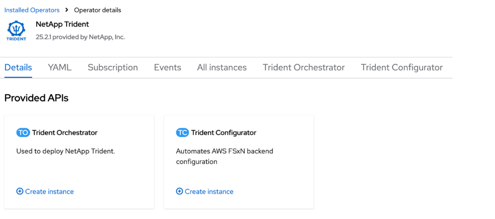
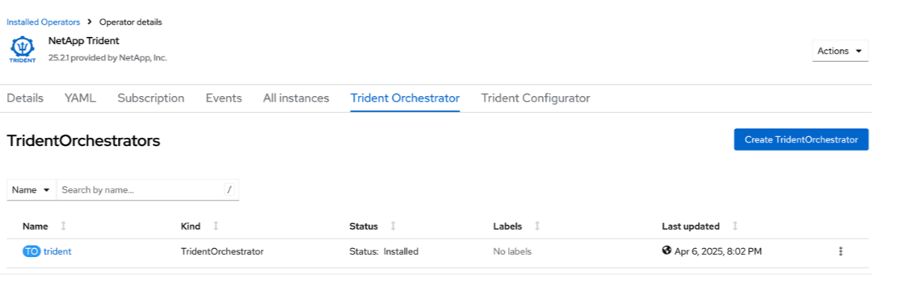

= OpenShift OperatorHub を使用してTrident をインストールする
:hardbreaks:
:allow-uri-read: 
:icons: font
:imagesdir: ../media/

[role="lead"]
Red Hat OpenShift を使用する場合は、Red Hat 認定オペレータを使用してNetApp Trident をインストールできます。この手順を使用して、Red Hat OpenShift Container Platform からTrident をインストールします。

.開始する前に
インストールを始める前に、link:../trident-get-started/requirements.html["Trident をインストールするための環境を準備する"] 。

== Tridentオペレーターを見つけてインストールする

.手順
. OpenShift OperatorHub に移動し、 NetApp Tridentを検索します。
+

. * NetApp Trident* をクリックしてインストール設定を開きます。
. 必要なオプションを選択し、「*インストール*」をクリックしてオペレーター構成を開きます。
+

+

NOTE: 必ず最新の Operator バージョンを選択してください。

. すべてのパラメータをそのままにして、[インストール] をクリックします。
+

+
インストールが完了すると、インストールされたオペレーターのリストにオペレーターが表示され、使用できるようになります。

. オペレーターの詳細を表示するには、「*オペレーターの表示*」をクリックします。
+

. * Trident Orchestrator* の下で、*インスタンスの作成* をクリックします。
+

. *YAML ビュー* をクリックし、次の内容をフォームに貼り付けます。
+
[source, yaml]
----
apiVersion: trident.netapp.io/v1
kind: TridentOrchestrator
metadata:
  name: trident
  namespace: openshift-operators
spec:
  IPv6: false
  debug: false
  nodePrep:
  - iscsi
  imageRegistry: ''
  k8sTimeout: 30
  namespace: trident
  silenceAutosupport: false
----
+
[]
====
** Red Hat Enterprise Linux CoreOS (RHCOS) では iSCSI が有効化および構成されていません。
** 追加できるのは `nodePrep`すべての OpenShift ワーカー ノードで iSCSI サービスとマルチパス サービスの両方を構成して有効にするパラメーター。
** OpenShift 4.19 以降、この機能でサポートされるTrident の最小バージョンは 25.06.1 です。

====
. *作成*をクリックすると、 Trident Orchestrator が完全にインストールされます。
+

== Tridentオペレーターをアンインストールする

.手順
. インストールされているオペレータのリストからTridentオペレータを選択します。
. 演算子からすべてのオペランドインスタンスを削除する場合に選択します。
+

WARNING: *この演算子からすべてのオペランド インスタンスを削除する* チェックボックスを選択しないと、 Trident はアンインストールされません。

. *アンインストール*をクリックします。

