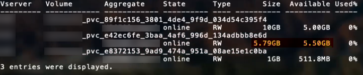

= ONTAP SAN 構成オプションと例
:hardbreaks:
:allow-uri-read: 
:icons: font
:imagesdir: ../media/

[role="lead"]
TridentインストールでONTAP SAN ドライバーを作成して使用する方法を学習します。このセクションでは、バックエンドを StorageClasses にマッピングするためのバックエンド構成の例と詳細について説明します。

link:https://docs.netapp.com/us-en/asa-r2/get-started/learn-about.html["ASA r2 システム"^]ストレージ層の実装は他のONTAPシステム (ASA、 AFF、 FAS) とは異なります。これらのバリエーションは、記載されている特定のパラメータの使用に影響します。link:https://docs.netapp.com/us-en/asa-r2/learn-more/hardware-comparison.html["ASA r2 システムと他のONTAPシステムの違いについて詳しくは、こちらをご覧ください。"^]。

NOTE: のみ `ontap-san`ドライバー (iSCSI および NVMe/TCP プロトコル付き) は、 ASA r2 システムでサポートされています。

Tridentバックエンド構成では、システムがASA r2 であることを指定する必要はありません。選択すると `ontap-san`として `storageDriverName`Trident は、 ASA r2 または従来のONTAPシステムを自動的に検出します。以下の表に示すように、一部のバックエンド構成パラメータはASA r2 システムには適用されません。

[[backend-configuration-options]]
== バックエンド構成オプション

バックエンドの構成オプションについては、次の表を参照してください。

[cols="1,3,2"]
|===
| パラメータ | 説明 | デフォルト 

| `version` |  | 常に1 

| `storageDriverName` | ストレージ ドライバーの名前 | `ontap-san`または `ontap-san-economy` 

| `backendName` | カスタム名またはストレージバックエンド | ドライバー名 + "_" + dataLIF 

| `managementLIF`  a| 
クラスタまたは SVM 管理 LIF の IP アドレス。

完全修飾ドメイン名 (FQDN) を指定できます。

Trident がIPv6 フラグを使用してインストールされている場合は、IPv6 アドレスを使用するように設定できます。  IPv6アドレスは角括弧で囲んで定義する必要があります。例: `[28e8:d9fb:a825:b7bf:69a8:d02f:9e7b:3555]` 。

シームレスなMetroClusterスイッチオーバーについては、<<mcc-best>> 。

NOTE: 「vsadmin」の資格情報を使用している場合は、 `managementLIF` SVMの認証情報である必要があります。「admin」認証情報を使用する場合は、 `managementLIF`クラスターのものである必要があります。
| "10.0.0.1"、"[2001:1234:abcd::fefe]" 

| `dataLIF` | プロトコル LIF の IP アドレス。  Trident がIPv6 フラグを使用してインストールされている場合は、IPv6 アドレスを使用するように設定できます。  IPv6アドレスは角括弧で囲んで定義する必要があります。例: `[28e8:d9fb:a825:b7bf:69a8:d02f:9e7b:3555]` 。 *iSCSI の場合は指定しないでください。*Tridentはlink:https://docs.netapp.com/us-en/ontap/san-admin/selective-lun-map-concept.html["ONTAP選択的 LUN マップ"^]マルチパス セッションを確立するために必要な iSCSI LIF を検出します。警告が発生するのは、 `dataLIF`明示的に定義されています。 *Metrocluster の場合は省略します。*参照<<mcc-best>>。 | SVMによって導出された 

| `svm` | 使用するストレージ仮想マシン *Metrocluster の場合は省略。*参照<<mcc-best>>。 | SVMの場合導出される `managementLIF`指定されている 

| `useCHAP` | CHAP を使用してONTAP SAN ドライバーの iSCSI を認証します [ブール値]。設定 `true`Trident がバックエンドで指定された SVM のデフォルト認証として双方向 CHAP を設定して使用できるようにします。参照 link:ontap-san-prep.html["ONTAP SAN ドライバーを使用してバックエンドを構成する準備をする"] 詳細については。  *FCP または NVMe/TCP ではサポートされません。* | `false` 

| `chapInitiatorSecret` | CHAP イニシエーター シークレット。必須の場合 `useCHAP=true` | "" 

| `labels` | ボリュームに適用する任意の JSON 形式のラベルのセット | "" 

| `chapTargetInitiatorSecret` | CHAP ターゲット イニシエーター シークレット。必須の場合 `useCHAP=true` | "" 

| `chapUsername` | 受信ユーザー名。必須の場合 `useCHAP=true` | "" 

| `chapTargetUsername` | ターゲットユーザー名。必須の場合 `useCHAP=true` | "" 

| `clientCertificate` | クライアント証明書の Base64 エンコードされた値。証明書ベースの認証に使用 | "" 

| `clientPrivateKey` | クライアント秘密キーの Base64 エンコードされた値。証明書ベースの認証に使用 | "" 

| `trustedCACertificate` | 信頼された CA 証明書の Base64 エンコードされた値。オプション。証明書ベースの認証に使用されます。 | "" 

| `username` | ONTAPクラスタと通信するために必要なユーザー名。資格情報ベースの認証に使用されます。Active Directory認証については、 link:../trident-use/ontap-san-examples.html#authenticate-trident-to-a-backend-svm-using-active-directory-credentials["Active Directory の認証情報を使用して、バックエンド SVM に対してTrident を認証する"]。 | "" 

| `password` | ONTAPクラスタと通信するために必要なパスワード。資格情報ベースの認証に使用されます。Active Directory認証については、 link:../trident-use/ontap-san-examples.html#authenticate-trident-to-a-backend-svm-using-active-directory-credentials["Active Directory の認証情報を使用して、バックエンド SVM に対してTrident を認証する"]。 | "" 

| `svm` | 使用するストレージ仮想マシン | SVMの場合導出される `managementLIF`指定されている 

| `storagePrefix` | SVM で新しいボリュームをプロビジョニングするときに使用されるプレフィックス。後で変更することはできません。このパラメータを更新するには、新しいバックエンドを作成する必要があります。 | `trident` 

| `aggregate`  a| 
プロビジョニング用のアグリゲート (オプション。設定する場合は、SVM に割り当てる必要があります)。のために `ontap-nas-flexgroup`ドライバーの場合、このオプションは無視されます。割り当てられていない場合は、使用可能なアグリゲートのいずれかを使用してFlexGroupボリュームをプロビジョニングできます。

NOTE: SVM でアグリゲートが更新されると、 Tridentコントローラーを再起動せずに、SVM をポーリングすることによってTridentでも自動的に更新されます。 Tridentで特定のアグリゲートをボリュームのプロビジョニング用に構成した場合、アグリゲートの名前が変更されたり、SVM から移動されたりすると、SVM アグリゲートをポーリングしているときに、 Tridentでバックエンドが障害状態になります。バックエンドをオンラインに戻すには、アグリゲートを SVM 上に存在するものに変更するか、完全に削除する必要があります。

* ASA r2 システムでは指定しないでください*。
 a| 
""

| `limitAggregateUsage` | 使用率がこのパーセンテージを超える場合、プロビジョニングは失敗します。 Amazon FSx for NetApp ONTAPバックエンドを使用している場合は、指定しないでください。 `limitAggregateUsage` 。提供された `fsxadmin`そして `vsadmin`集計使用量を取得し、 Trident を使用して制限するために必要な権限が含まれていません。  * ASA r2 システムでは指定しないでください*。 | "" (デフォルトでは強制されません) 

| `limitVolumeSize` | 要求されたボリューム サイズがこの値を超える場合、プロビジョニングは失敗します。また、LUN に対して管理するボリュームの最大サイズも制限します。 | "" (デフォルトでは強制されません) 

| `lunsPerFlexvol` | Flexvolあたりの最大LUN数は[50, 200]の範囲でなければなりません | `100` 

| `debugTraceFlags` | トラブルシューティング時に使用するデバッグ フラグ。例: {"api":false, "method":true} トラブルシューティングを行っており、詳細なログ ダンプが必要な場合を除き、使用しないでください。 | `null` 

| `useREST`  a| 
ONTAP REST API を使用するためのブール パラメーター。

 `useREST`に設定すると `true`、 TridentはONTAP REST APIを使用してバックエンドと通信します。 `false` Trident は、バックエンドとの通信に ONTAPI (ZAPI) 呼び出しを使用します。この機能にはONTAP 9.11.1 以降が必要です。さらに、使用するONTAPログインロールには、 `ontapi`応用。これは、事前に定義された `vsadmin`そして `cluster-admin`役割。  Trident 24.06リリースおよびONTAP 9.15.1以降では、 `useREST`設定されている `true`デフォルト; 変更 `useREST`に `false`ONTAPI (ZAPI) 呼び出しを使用します。

`useREST`NVMe/TCP に完全対応しています。

NOTE: NVMe はONTAP REST API でのみサポートされ、ONTAPI (ZAPI) ではサポートされません。

*指定されている場合、常に `true`ASA r2 システムの場合*。
| `true`ONTAP 9.15.1以降の場合、それ以外の場合 `false`。 

 a| 
`sanType`
| 選択するには使用 `iscsi`iSCSIの場合、 `nvme` NVMe/TCPの場合または `fcp`SCSI over Fibre Channel (FC) 用。 | `iscsi`空白の場合 

| `formatOptions`  a| 
使用 `formatOptions`コマンドライン引数を指定するには `mkfs`ボリュームがフォーマットされるたびに適用されます。これにより、好みに応じてボリュームをフォーマットできます。デバイス パスを除いて、mkfs コマンド オプションと同様の formatOptions を指定してください。例: "-E nodiscard"

*対応機種 `ontap-san`そして `ontap-san-economy`iSCSI プロトコルを使用したドライバー。*  *さらに、iSCSI および NVMe/TCP プロトコルを使用する場合、 ASA r2 システムでもサポートされます。*
 a| 

| `limitVolumePoolSize` | ontap-san-economy バックエンドで LUN を使用する場合の、要求可能なFlexVol の最大サイズ。 | "" (デフォルトでは強制されません) 

| `denyNewVolumePools` | 制限 `ontap-san-economy`バックエンドが LUN を格納するための新しいFlexVolボリュームを作成できないようにします。新しい PV のプロビジョニングには、既存の Flexvol のみが使用されます。 |  
|===

[[recommendations-for-using-formatoptions]]
=== formatOptionsの使用に関する推奨事項

Trident は、フォーマット処理を高速化するために次のオプションを推奨します。

*-E 破棄なし:*

* 保持し、mkfs 時にブロックを破棄しないでください (最初にブロックを破棄することは、ソリッド ステート デバイスおよびスパース / シン プロビジョニング ストレージで役立ちます)。これは非推奨のオプション「-K」に代わるもので、すべてのファイルシステム (xfs、ext3、ext4) に適用できます。

[[authenticate-trident-to-a-backend-svm-using-active-directory-credentials]]
=== Active Directory の認証情報を使用して、バックエンド SVM に対してTrident を認証する

Active Directory (AD) 認証情報を使用してバックエンド SVM に対して認証するようにTrident を設定できます。AD アカウントが SVM にアクセスする前に、クラスタまたは SVM への AD ドメイン コントローラ アクセスを設定する必要があります。AD アカウントを使用してクラスターを管理するには、ドメイン トンネルを作成する必要があります。参照 link:https://docs.netapp.com/us-en/ontap/authentication/enable-ad-users-groups-access-cluster-svm-task.html["ONTAPでActive Directoryドメインコントローラのアクセスを構成する"^] 詳細については。

.手順
. バックエンド SVM のドメイン ネーム システム (DNS) 設定を構成します。
+
`vserver services dns create -vserver <svm_name> -dns-servers <dns_server_ip1>,<dns_server_ip2>`

. 次のコマンドを実行して、Active Directory に SVM のコンピュータ アカウントを作成します。
+
`vserver active-directory create -vserver DataSVM -account-name ADSERVER1 -domain demo.netapp.com`

. このコマンドを使用して、クラスタまたはSVMを管理するためのADユーザーまたはグループを作成します。
+
`security login create -vserver <svm_name> -user-or-group-name <ad_user_or_group> -application <application> -authentication-method domain -role vsadmin`

. Tridentバックエンド設定ファイルで、 `username` そして `password` パラメータをそれぞれ AD ユーザー名またはグループ名とパスワードに渡します。

[[backend-configuration-options-for-provisioning-volumes]]
== ボリュームのプロビジョニングのためのバックエンド構成オプション

デフォルトのプロビジョニングは、以下のオプションを使用して制御できます。 `defaults`構成のセクション。例については、以下の構成例を参照してください。

[cols="1,3,2"]
|===
| パラメータ | 説明 | デフォルト 

| `spaceAllocation` | LUNのスペース割り当て | "true" *指定されている場合は、 `true` ASA r2 システムの場合*。 

| `spaceReserve` | スペース予約モード。「なし」(薄い) または「ボリューム」(厚い)。  *設定 `none`ASA r2* システムの場合。 | "なし" 

| `snapshotPolicy` | 使用するスナップショット ポリシー。  *設定 `none`ASA r2 システムの場合*。 | "なし" 

| `qosPolicy` | 作成されたボリュームに割り当てる QoS ポリシー グループ。ストレージ プール/バックエンドごとに qosPolicy または adaptiveQosPolicy のいずれかを選択します。 Tridentで QoS ポリシー グループを使用するには、 ONTAP 9.8 以降が必要です。共有されていない QoS ポリシー グループを使用し、ポリシー グループが各構成要素に個別に適用されるようにする必要があります。共有 QoS ポリシー グループは、すべてのワークロードの合計スループットの上限を適用します。 | "" 

| `adaptiveQosPolicy` | 作成されたボリュームに割り当てるアダプティブ QoS ポリシー グループ。ストレージプール/バックエンドごとに qosPolicy または adaptiveQosPolicy のいずれかを選択します | "" 

| `snapshotReserve` | スナップショット用に予約されているボリュームの割合。  * ASA r2 システムでは指定しないでください*。 | 「0」の場合 `snapshotPolicy`は「なし」、それ以外の場合は「」 

| `splitOnClone` | クローン作成時に親からクローンを分割する | "間違い" 

| `encryption` | 新しいボリュームでNetAppボリューム暗号化（NVE）を有効にします。デフォルトは `false`。このオプションを使用するには、NVE のライセンスを取得し、クラスターで有効にする必要があります。バックエンドで NAE が有効になっている場合、 Tridentでプロビジョニングされたすべてのボリュームで NAE が有効になります。詳細については、以下を参照してください。link:../trident-reco/security-reco.html["Trident がNVE および NAE と連携する仕組み"] 。 | "false" *指定されている場合は、 `true` ASA r2 システムの場合*。 

| `luksEncryption` | LUKS 暗号化を有効にします。参照link:../trident-reco/security-luks.html["Linux Unified Key Setup (LUKS) を使用する"]。 | "" *設定 `false`ASA r2 システムの場合*。 

| `tieringPolicy` | 階層化ポリシーは「なし」を使用します。* ASA r2 システムでは指定しないでください。* |  

| `nameTemplate` | カスタムボリューム名を作成するためのテンプレート。 | "" 
|===

[[volume-provisioning-examples]]
=== ボリュームプロビジョニングの例

デフォルトを定義した例を次に示します。

[source, yaml]
----
---
version: 1
storageDriverName: ontap-san
managementLIF: 10.0.0.1
svm: trident_svm
username: admin
password: <password>
labels:
  k8scluster: dev2
  backend: dev2-sanbackend
storagePrefix: alternate-trident
debugTraceFlags:
  api: false
  method: true
defaults:
  spaceReserve: volume
  qosPolicy: standard
  spaceAllocation: 'false'
  snapshotPolicy: default
  snapshotReserve: '10'

----

NOTE: 作成されたすべてのボリュームについて `ontap-san`ドライバーにより、 Trident はLUN メタデータに対応するためにFlexVolに 10 パーセントの容量を追加します。  LUN は、ユーザーが PVC で要求した正確なサイズでプロビジョニングされます。 Trident はFlexVolに 10 パーセントを追加します ( ONTAPでは使用可能なサイズとして表示されます)。ユーザーは要求した使用可能な容量を取得できるようになります。この変更により、使用可能なスペースが完全に使用されない限り、LUN が読み取り専用になることも防止されます。これは ontap-san-economy には適用されません。

定義するバックエンドの場合 `snapshotReserve`Trident はボリュームのサイズを次のように計算します。

[listing]
----
Total volume size = [(PVC requested size) / (1 - (snapshotReserve percentage) / 100)] * 1.1
----
にTridentがFlexVolに追加する10%の容量です。のために `snapshotReserve`= 5%、PVC 要求 = 5 GiB の場合、ボリュームの合計サイズは 5.79 GiB、使用可能なサイズは 5.5 GiB になります。その `volume show`コマンドを実行すると、次の例のような結果が表示されます。

現在、既存のボリュームに対して新しい計算を使用する唯一の方法は、サイズ変更です。

[[minimal-configuration-examples]]
== 最小限の構成例

次の例は、ほとんどのパラメータをデフォルトのままにする基本構成を示しています。これはバックエンドを定義する最も簡単な方法です。

NOTE: Tridentを搭載したNetApp ONTAPでAmazon FSx を使用している場合、 NetApp、 LIF に IP アドレスではなく DNS 名を指定することを推奨しています。

.ONTAP SANの例
[%collapsible]
====
これは、 `ontap-san`ドライバ。

[source, yaml]
----
---
version: 1
storageDriverName: ontap-san
managementLIF: 10.0.0.1
svm: svm_iscsi
labels:
  k8scluster: test-cluster-1
  backend: testcluster1-sanbackend
username: vsadmin
password: <password>
----
====
.MetroClusterの例
[#mcc-best%collapsible]
====
バックエンドを設定することで、スイッチオーバーとスイッチバック後にバックエンド定義を手動で更新する必要がなくなります。link:../trident-reco/backup.html#svm-replication-and-recovery["SVMのレプリケーションとリカバリ"] 。

シームレスなスイッチオーバーとスイッチバックを行うには、SVMを次のように指定します。 `managementLIF`そして省略する `svm`パラメータ。例えば：

[source, yaml]
----
version: 1
storageDriverName: ontap-san
managementLIF: 192.168.1.66
username: vsadmin
password: password
----
====
.ONTAP SANエコノミーの例
[%collapsible]
====
[source, yaml]
----
version: 1
storageDriverName: ontap-san-economy
managementLIF: 10.0.0.1
svm: svm_iscsi_eco
username: vsadmin
password: <password>
----
====
.証明書ベースの認証の例
[%collapsible]
====
この基本構成例では `clientCertificate`、 `clientPrivateKey` 、 そして `trustedCACertificate`（信頼できるCAを使用する場合はオプション）が入力されます `backend.json`クライアント証明書、秘密キー、信頼できる CA 証明書の base64 エンコードされた値をそれぞれ取得します。

[source, yaml]
----
---
version: 1
storageDriverName: ontap-san
backendName: DefaultSANBackend
managementLIF: 10.0.0.1
svm: svm_iscsi
useCHAP: true
chapInitiatorSecret: cl9qxIm36DKyawxy
chapTargetInitiatorSecret: rqxigXgkesIpwxyz
chapTargetUsername: iJF4heBRT0TCwxyz
chapUsername: uh2aNCLSd6cNwxyz
clientCertificate: ZXR0ZXJwYXB...ICMgJ3BhcGVyc2
clientPrivateKey: vciwKIyAgZG...0cnksIGRlc2NyaX
trustedCACertificate: zcyBbaG...b3Igb3duIGNsYXNz
----
====
.双方向CHAPの例
[%collapsible]
====
これらの例では、 `useCHAP`に設定 `true`。

.ONTAP SAN CHAPの例
[source, yaml]
----
---
version: 1
storageDriverName: ontap-san
managementLIF: 10.0.0.1
svm: svm_iscsi
labels:
  k8scluster: test-cluster-1
  backend: testcluster1-sanbackend
useCHAP: true
chapInitiatorSecret: cl9qxIm36DKyawxy
chapTargetInitiatorSecret: rqxigXgkesIpwxyz
chapTargetUsername: iJF4heBRT0TCwxyz
chapUsername: uh2aNCLSd6cNwxyz
username: vsadmin
password: <password>
----
.ONTAP SANエコノミーCHAPの例
[source, yaml]
----
---
version: 1
storageDriverName: ontap-san-economy
managementLIF: 10.0.0.1
svm: svm_iscsi_eco
useCHAP: true
chapInitiatorSecret: cl9qxIm36DKyawxy
chapTargetInitiatorSecret: rqxigXgkesIpwxyz
chapTargetUsername: iJF4heBRT0TCwxyz
chapUsername: uh2aNCLSd6cNwxyz
username: vsadmin
password: <password>
----
====
.NVMe/TCPの例
[%collapsible]
====
ONTAPバックエンドに NVMe が設定された SVM が必要です。これは、NVMe/TCP の基本的なバックエンド構成です。

[source, yaml]
----
---
version: 1
backendName: NVMeBackend
storageDriverName: ontap-san
managementLIF: 10.0.0.1
svm: svm_nvme
username: vsadmin
password: password
sanType: nvme
useREST: true
----
====
.SCSI over FC (FCP) の例
[%collapsible]
====
ONTAPバックエンドに FC が設定された SVM が必要です。これは FC の基本的なバックエンド構成です。

[source, yaml]
----
---
version: 1
backendName: fcp-backend
storageDriverName: ontap-san
managementLIF: 10.0.0.1
svm: svm_fc
username: vsadmin
password: password
sanType: fcp
useREST: true
----
====
.nameTemplate を使用したバックエンド構成の例
[%collapsible]
====
[source, yaml]
----
---
version: 1
storageDriverName: ontap-san
backendName: ontap-san-backend
managementLIF: <ip address>
svm: svm0
username: <admin>
password: <password>
defaults:
  nameTemplate: "{{.volume.Name}}_{{.labels.cluster}}_{{.volume.Namespace}}_{{.vo\
    lume.RequestName}}"
labels:
  cluster: ClusterA
  PVC: "{{.volume.Namespace}}_{{.volume.RequestName}}"
----
====
.ontap-san-economy ドライバーの formatOptions の例
[%collapsible]
====
[source, yaml]
----
---
version: 1
storageDriverName: ontap-san-economy
managementLIF: ""
svm: svm1
username: ""
password: "!"
storagePrefix: whelk_
debugTraceFlags:
  method: true
  api: true
defaults:
  formatOptions: -E nodiscard
----
====

[[examples-of-backends-with-virtual-pools]]
== 仮想プールを備えたバックエンドの例

これらのサンプルバックエンド定義ファイルでは、すべてのストレージプールに対して特定のデフォルトが設定されています。 `spaceReserve`どれも、 `spaceAllocation`偽で、そして `encryption`偽です。仮想プールはストレージ セクションで定義されます。

Trident は、 「コメント」フィールドにプロビジョニング ラベルを設定します。コメントはFlexVol volumeに設定され、 Trident はプロビジョニング時に仮想プールに存在するすべてのラベルをストレージ ボリュームにコピーします。便宜上、ストレージ管理者は仮想プールごとにラベルを定義し、ラベルごとにボリュームをグループ化できます。

これらの例では、一部のストレージプールは独自の `spaceReserve`、 `spaceAllocation` 、 そして `encryption`値があり、一部のプールはデフォルト値を上書きします。

.ONTAP SANの例
[%collapsible]
====
[source, yaml]
----
---
version: 1
storageDriverName: ontap-san
managementLIF: 10.0.0.1
svm: svm_iscsi
useCHAP: true
chapInitiatorSecret: cl9qxIm36DKyawxy
chapTargetInitiatorSecret: rqxigXgkesIpwxyz
chapTargetUsername: iJF4heBRT0TCwxyz
chapUsername: uh2aNCLSd6cNwxyz
username: vsadmin
password: <password>
defaults:
  spaceAllocation: "false"
  encryption: "false"
  qosPolicy: standard
labels:
  store: san_store
  kubernetes-cluster: prod-cluster-1
region: us_east_1
storage:
  - labels:
      protection: gold
      creditpoints: "40000"
    zone: us_east_1a
    defaults:
      spaceAllocation: "true"
      encryption: "true"
      adaptiveQosPolicy: adaptive-extreme
  - labels:
      protection: silver
      creditpoints: "20000"
    zone: us_east_1b
    defaults:
      spaceAllocation: "false"
      encryption: "true"
      qosPolicy: premium
  - labels:
      protection: bronze
      creditpoints: "5000"
    zone: us_east_1c
    defaults:
      spaceAllocation: "true"
      encryption: "false"

----
====
.ONTAP SANエコノミーの例
[%collapsible]
====
[source, yaml]
----
---
version: 1
storageDriverName: ontap-san-economy
managementLIF: 10.0.0.1
svm: svm_iscsi_eco
useCHAP: true
chapInitiatorSecret: cl9qxIm36DKyawxy
chapTargetInitiatorSecret: rqxigXgkesIpwxyz
chapTargetUsername: iJF4heBRT0TCwxyz
chapUsername: uh2aNCLSd6cNwxyz
username: vsadmin
password: <password>
defaults:
  spaceAllocation: "false"
  encryption: "false"
labels:
  store: san_economy_store
region: us_east_1
storage:
  - labels:
      app: oracledb
      cost: "30"
    zone: us_east_1a
    defaults:
      spaceAllocation: "true"
      encryption: "true"
  - labels:
      app: postgresdb
      cost: "20"
    zone: us_east_1b
    defaults:
      spaceAllocation: "false"
      encryption: "true"
  - labels:
      app: mysqldb
      cost: "10"
    zone: us_east_1c
    defaults:
      spaceAllocation: "true"
      encryption: "false"
  - labels:
      department: legal
      creditpoints: "5000"
    zone: us_east_1c
    defaults:
      spaceAllocation: "true"
      encryption: "false"

----
====
.NVMe/TCPの例
[%collapsible]
====
[source, yaml]
----
---
version: 1
storageDriverName: ontap-san
sanType: nvme
managementLIF: 10.0.0.1
svm: nvme_svm
username: vsadmin
password: <password>
useREST: true
defaults:
  spaceAllocation: "false"
  encryption: "true"
storage:
  - labels:
      app: testApp
      cost: "20"
    defaults:
      spaceAllocation: "false"
      encryption: "false"

----
====

[[map-backends-to-storageclasses]]
== バックエンドをStorageClassesにマッピングする

以下のStorageClass定義は、<<仮想プールを備えたバックエンドの例>> 。使用して `parameters.selector`フィールドでは、各 StorageClass はボリュームをホストするために使用できる仮想プールを呼び出します。ボリュームには、選択した仮想プールで定義された側面が設定されます。

* その `protection-gold`ストレージクラスは、 `ontap-san`バックエンド。これはゴールド レベルの保護を提供する唯一のプールです。
+
[source, yaml]
----
apiVersion: storage.k8s.io/v1
kind: StorageClass
metadata:
  name: protection-gold
provisioner: csi.trident.netapp.io
parameters:
  selector: "protection=gold"
  fsType: "ext4"
----
* その `protection-not-gold`ストレージクラスは、2番目と3番目の仮想プールにマッピングされます。 `ontap-san`バックエンド。これらは、ゴールド以外の保護レベルを提供する唯一のプールです。
+
[source, yaml]
----
apiVersion: storage.k8s.io/v1
kind: StorageClass
metadata:
  name: protection-not-gold
provisioner: csi.trident.netapp.io
parameters:
  selector: "protection!=gold"
  fsType: "ext4"
----
* その `app-mysqldb`StorageClassは3番目の仮想プールにマッピングされます `ontap-san-economy`バックエンド。これは、mysqldb タイプのアプリにストレージ プール構成を提供する唯一のプールです。
+
[source, yaml]
----
apiVersion: storage.k8s.io/v1
kind: StorageClass
metadata:
  name: app-mysqldb
provisioner: csi.trident.netapp.io
parameters:
  selector: "app=mysqldb"
  fsType: "ext4"
----
* その `protection-silver-creditpoints-20k`ストレージクラスは2番目の仮想プールにマッピングされます `ontap-san`バックエンド。これは、シルバー レベルの保護と 20,000 クレジット ポイントを提供する唯一のプールです。
+
[source, yaml]
----
apiVersion: storage.k8s.io/v1
kind: StorageClass
metadata:
  name: protection-silver-creditpoints-20k
provisioner: csi.trident.netapp.io
parameters:
  selector: "protection=silver; creditpoints=20000"
  fsType: "ext4"
----
* その `creditpoints-5k`StorageClassは3番目の仮想プールにマッピングされます `ontap-san`バックエンドと4番目の仮想プール `ontap-san-economy`バックエンド。これらは 5000 クレジットポイントで提供される唯一のプールです。
+
[source, yaml]
----
apiVersion: storage.k8s.io/v1
kind: StorageClass
metadata:
  name: creditpoints-5k
provisioner: csi.trident.netapp.io
parameters:
  selector: "creditpoints=5000"
  fsType: "ext4"
----
* その `my-test-app-sc`StorageClassは `testAPP`仮想プール `ontap-san`ドライバー付き `sanType: nvme`。これは唯一のプールの提供です `testApp`。
+
[source, yaml]
----
---
apiVersion: storage.k8s.io/v1
kind: StorageClass
metadata:
  name: my-test-app-sc
provisioner: csi.trident.netapp.io
parameters:
  selector: "app=testApp"
  fsType: "ext4"
----

Trident はどの仮想プールが選択されるか決定し、ストレージ要件が満たされていることを確認します。
