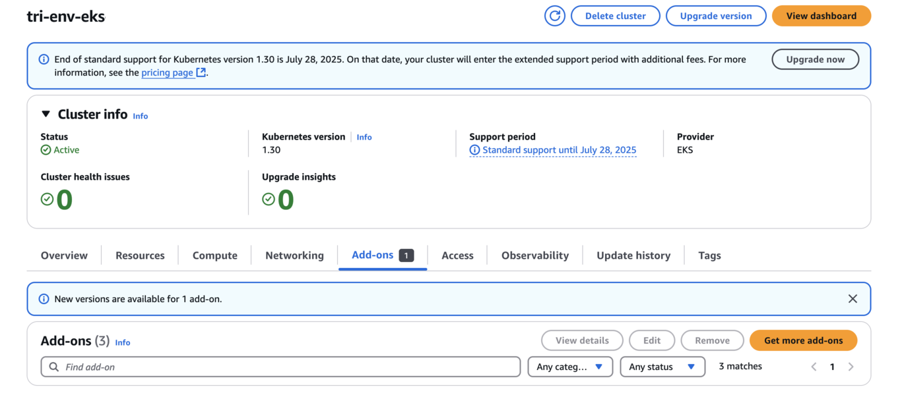
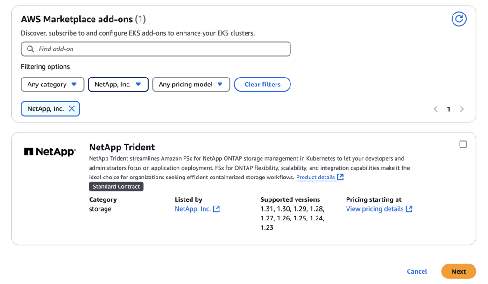
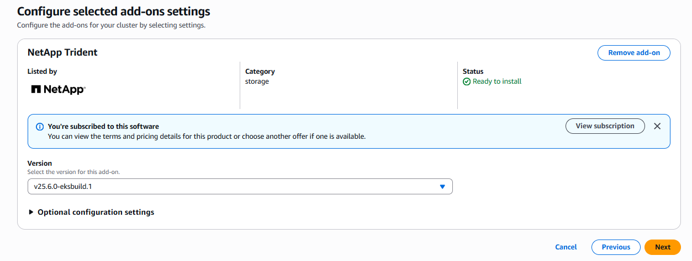
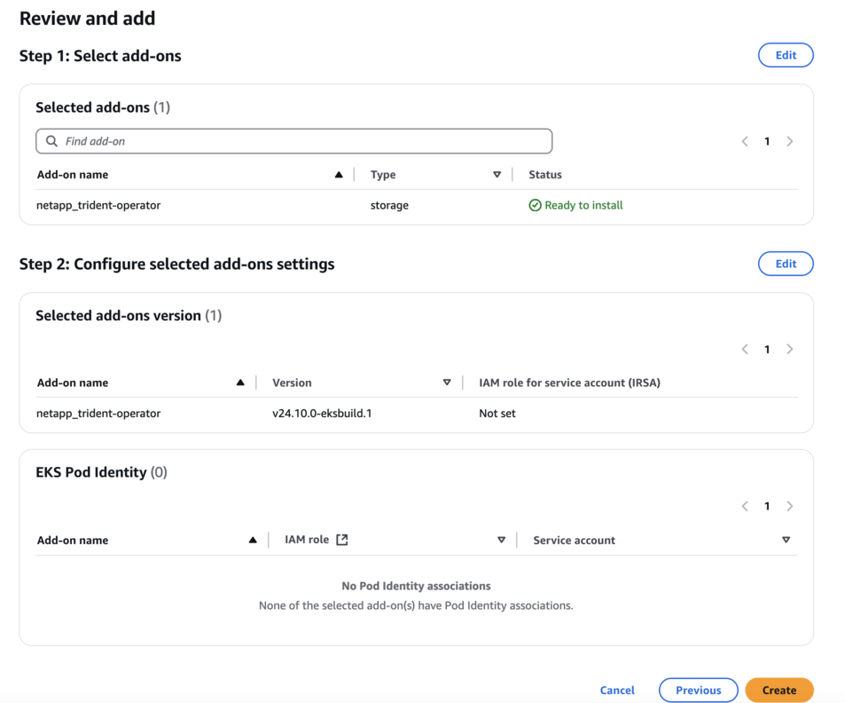
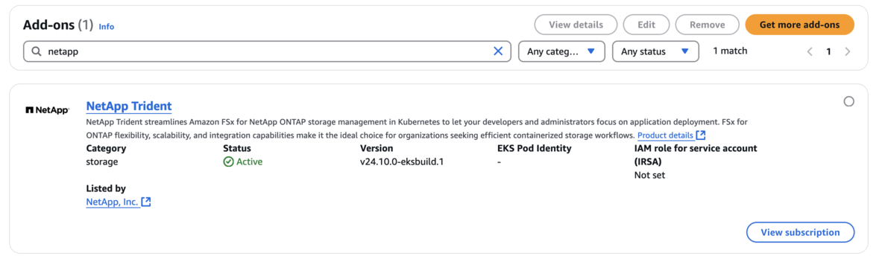

= EKS クラスターでTrident EKS アドオンを構成する
:hardbreaks:
:allow-uri-read: 
:icons: font
:imagesdir: ../media/

[role="lead"]
NetApp Trident は、 Kubernetes でのAmazon FSx for NetApp ONTAPストレージ管理を合理化し、開発者と管理者がアプリケーションの導入に集中できるようにします。  NetApp Trident EKS アドオンには最新のセキュリティパッチとバグ修正が含まれており、Amazon EKS で動作することが AWS によって検証されています。  EKS アドオンを使用すると、Amazon EKS クラスターの安全性と安定性を常に確保し、アドオンのインストール、設定、更新に必要な作業量を削減できます。

== 前提条件

AWS EKS のTridentアドオンを設定する前に、以下があることを確認してください。

* アドオンを操作する権限を持つ Amazon EKS クラスターアカウント。参照link:https://docs.aws.amazon.com/eks/latest/userguide/eks-add-ons.html["Amazon EKS アドオン"^]。
* AWS マーケットプレイスへの AWS 権限:
`"aws-marketplace:ViewSubscriptions",
"aws-marketplace:Subscribe",
"aws-marketplace:Unsubscribe`
* AMI タイプ: Amazon Linux 2 (AL2_x86_64) または Amazon Linux 2 Arm(AL2_ARM_64)
* ノードタイプ: AMD またはARM
* 既存のAmazon FSx for NetApp ONTAPファイルシステム

== 手順

. EKS ポッドが AWS リソースにアクセスできるようにするには、IAM ロールと AWS シークレットを作成してください。手順については、link:../trident-use/trident-fsx-iam-role.html["IAMロールとAWSシークレットを作成する"^] 。
. EKS Kubernetes クラスターで、[*アドオン*] タブに移動します。
+

. *AWS Marketplace アドオン* に移動し、_storage_ カテゴリを選択します。
+

. * NetApp Trident* を見つけて、 Tridentアドオンのチェックボックスをオンにし、*次へ* をクリックします。
. アドオンの希望するバージョンを選択します。
+

. 必要なアドオン設定を構成します。
+

. IRSA（サービスアカウントのIAMロール）を使用している場合は、追加の構成手順を参照してください。link:https://docs.netapp.com/us-en/trident/trident-use/trident-fsx-install-trident.html#enable-the-trident-add-on-for-aws["ここをクリックしてください。"] 。
. *作成*を選択します。
. アドオンのステータスが _アクティブ_ であることを確認します。
+

. 次のコマンドを実行して、 Tridentがクラスターに正しくインストールされていることを確認します。
+
[listing]
----
kubectl get pods -n trident
----
. セットアップを続行し、ストレージ バックエンドを構成します。詳細については、link:../trident-use/trident-fsx-storage-backend.html["ストレージバックエンドを構成する"^] 。

== CLI を使用してTrident EKS アドオンをインストール/アンインストールする

.CLI を使用してNetApp Trident EKS アドオンをインストールします。
次のコマンド例は、 Trident EKS アドオンをインストールします。
`eksctl create addon --cluster clusterName --name netapp_trident-operator --version v25.6.0-eksbuild.1` （専用版あり）

.CLI を使用してNetApp Trident EKS アドオンをアンインストールします。
次のコマンドは、 Trident EKS アドオンをアンインストールします。

[listing]
----
eksctl delete addon --cluster K8s-arm --name netapp_trident-operator
----